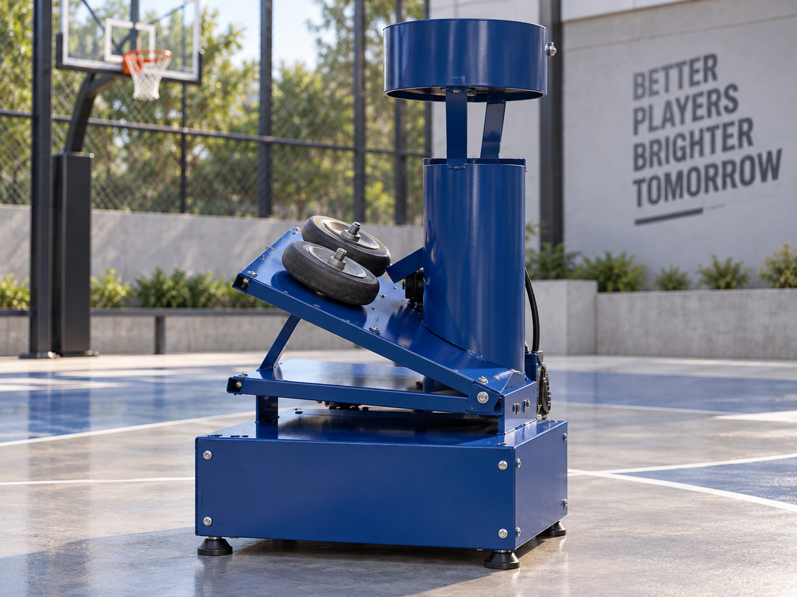

# 🏀 Shot-Bot 106 — Smart Basketball Training Machine

<p align="center">
  
</p>

<p align="center">
  <b>Sport-Tech Solution for Smarter and More Inclusive Basketball Training</b>
</p>

**Project:** Shot-Bot 106  
**Category:** Sport-Tech / Mechatronics / Assistive Sports Technology  
**Tools:** SolidWorks, CAD/STEP, Embedded Hardware, Computer Vision, IoT  

Shot-Bot 106 is a **smart basketball training machine** designed to improve the efficiency, accessibility, and quality of basketball practice.

The project was developed as a Sport-Tech solution that combines a **mechanical shooting/training machine** with smart technologies such as **IoT, cloud-based analytics, computer vision, and a mobile application**.

A key goal of the project is to make basketball training more adaptive and inclusive, including applications for **wheelchair basketball players** and athletes who need a more autonomous training setup.

---

## 🎯 The Problem

Traditional basketball training can suffer from:

- repetitive manual ball retrieval
- inefficient practice cycles
- dependence on another person or coach
- limited performance feedback
- limited accessibility for some athletes

Shot-Bot 106 was designed to provide a more **automated, data-driven, and independent training experience**.

---

## 💡 The Solution

The system combines a physical basketball-training machine with smart software and connected services.

```text
Player
   ↓
Training Exercise
   ↓
Shot-Bot Mechanical System
   ↓
Ball Return / Training Assistance
   ↓
Sensors + Smart Electronics
   ↓
IoT / Computer Vision / Cloud
   ↓
Mobile App + Performance Feedback
```

The broader concept includes:

- automated basketball training
- adjustable training exercises
- mobile-app interaction
- performance monitoring
- device pairing
- cloud-based analytics
- real-time feedback
- computer-vision integration

---

## 🏀 Training Modes

The project presentation proposes several basketball training modes:

```text
Shooting
Passing
Defense
Dribbling
```

The mobile interface also includes:

- Start Exercise
- Performance
- Pair Device
- About Us

This creates a platform that can evolve beyond a single shooting machine into a broader smart-training system.

---

## ⚙️ Mechanical Design

The machine was designed and modeled using **SolidWorks**.

The physical prototype contains:

- structural steel frame
- main base
- ball-handling / feeding section
- rotating / circular mechanical elements
- vertical support structure
- upper ball-handling section
- wheels and drive components
- motorized mechanisms

The design was iterated through several CAD parts before being assembled into the final concept.

### Main CAD Components

Examples of the available parts include:

```text
base shot
circular plate
shaft
upper shot
shot bot assembly
```

The native SolidWorks files are stored under:

```text
Solidworks/
```

---

## 🧱 STEP Models

STEP versions of the main mechanical parts are stored separately for easier interoperability with other CAD tools.

```text
STEP/
├── base shot.STEP
├── circular plate.STEP
├── shaft.STEP
└── upper shot.STEP
```

These files can be opened in most modern CAD packages, including:

- SolidWorks
- Autodesk Inventor
- Fusion 360
- FreeCAD
- CATIA
- Siemens NX

---

## 📱 Smart System Concept

The project was designed as more than a standalone mechanical training machine.

The proposed smart ecosystem includes:

### IoT
Provides real-time communication between the training machine, sensors, and connected devices.

### Cloud Computing
Supports:

- performance analytics
- training-history storage
- user profiles
- facility-level monitoring

### Computer Vision
Can be used to evaluate athlete movement, ball position, or shooting behavior.

### Mobile Application
The application concept supports:

- user accounts
- device pairing
- selecting exercises
- monitoring performance
- receiving feedback

---

## ♿ Inclusive Sports Technology

A major part of the concept is **basketball inclusivity**.

Shot-Bot 106 was presented as a solution that could support:

- wheelchair basketball players
- individual athletes
- gyms and fitness centers
- basketball academies
- sports institutions

By reducing dependence on manual ball retrieval and additional training staff, the machine can help make solo practice more accessible.

---

## 📊 Business Concept

The project also included a full business model.

### Target Customers

- Basketball players
- Basketball clubs and academies
- Local gyms and fitness centers
- Sports institutions

### Revenue Model

```text
Direct Sales (D2C)
B2B Contracts
Subscription Plans
Maintenance Services
Spare Parts
```

### Sales Channels

- events and exhibitions
- sponsors
- offline booths
- company website
- company headquarters

### Prototype Cost

The presentation estimated the prototype cost at approximately:

```text
75,000 EGP
```

---

## 🌍 Sustainability & Impact

The project presentation links Shot-Bot 106 to several UN Sustainable Development Goals:

- **SDG 8** — Decent Work and Economic Growth
- **SDG 9** — Industry, Innovation and Infrastructure
- **SDG 10** — Reduced Inequalities
- **SDG 17** — Partnerships for the Goals

---

## 📂 Repository Structure

```text
Shot-Bot-106/
│
├── README.md
├── Shot-Bot 106.pdf
├── Shot_Bot.png
│
├── Solidworks/
│   ├── base shot.SLDPRT
│   ├── Base Shot__1.SLDPRT
│   ├── circular plate.SLDPRT
│   ├── shaft(1).SLDPRT
│   ├── upper shot.SLDPRT
│   └── shot bot assembly.SLDASM
│
└── STEP/
    ├── base shot.STEP
    ├── circular plate.STEP
    ├── shaft.STEP
    └── upper shot.STEP
```

---

## 📚 Project Documentation

### `Shot-Bot 106.pdf`

The project presentation covers:

- problem definition
- proposed solution
- physical prototype
- CAD design
- mobile-app concept
- PCB concept
- market size
- target customers
- business model
- competition analysis
- cost structure
- prototype price
- key partners
- team

### `Shot_Bot.png`

A rendered visualization of the final Shot-Bot concept suitable for portfolio and GitHub presentation.

---

## 🚀 What This Project Demonstrates

- Mechanical CAD design
- Mechatronic system development
- Sports-technology innovation
- Assistive / inclusive engineering
- STEP-based CAD interoperability
- Product prototyping
- IoT system thinking
- Computer-vision integration concepts
- Mobile-app integration concepts
- Product and business-model development

---

## 📝 Note

This repository documents the available design and project material for Shot-Bot 106.

The repository currently contains the project presentation, rendered project image, native SolidWorks files, and STEP models. The smart software, IoT, cloud, computer-vision, and mobile-app components are documented as part of the proposed system architecture in the project presentation.

---

> **Shot-Bot 106** combines mechanical engineering, smart technologies, and inclusive sports design to create a more autonomous and adaptive basketball training experience.
